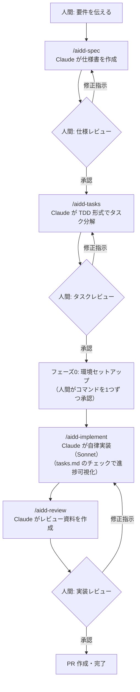

# AIDD Template — Claude 主導開発テンプレート

開発は Claude Code に任せ、人間は **仕様のレビュー** と **実装のレビュー** の2点に集中するためのテンプレートです。
実装中の進行状況は `tasks.md` のチェックボックスでいつでも確認できます。

## 3つのフロー

このテンプレートには目的別に3つのフローがあります。変更の性質に合わせて選んでください:

| フロー | コマンド | 使うとき | 成果物 | 人間の役割 |
|---|---|---|---|---|
| ① **ビジョン**（別枠・随時） | `/aidd-design` | プロジェクトの大域方針を決める・見直すとき | `.aidd-docs/vision.md`（生きたドキュメント） | 対話で選択肢を決断し、ビジョン更新を承認 |
| ② **spec ループ**（開発の本流） | `/aidd-spec`→`/aidd-tasks`→`/aidd-implement`→`/aidd-review` | 機能の追加・変更（仕様を書く価値がある規模） | 仕様＋タスク＋実装 = 1 PR | 仕様・タスク・実装の3点をレビューして承認 |
| ③ **軽量フロー**（別枠・随時） | `/aidd-check` | typo・小さなバグ修正など、自分で直したほうが早い変更 | Git 履歴のみ（仕様は作らない） | 自分で修正し、Claude のレビューを受ける |

3つの関係: ①のビジョンが②③の判断基準になり（ズレると Claude が確認してくる）、②のループが完了するたびにビジョンへの貢献が記録されて**実現度**が見えるようになります。②でやるほどでもない変更は③で、③でやるには大きすぎる変更は②へ、と相互に誘導されます。

## コマンド一覧（できる操作はすべてここにあります）

想定されている操作はすべてコマンド化されています。コマンドにない運用を Claude が即興で作ることはありません。
コマンド名には、エージェント組み込みのコマンド（/review /status /docs 等）との衝突を避けるため `aidd-` プレフィックスが付いています。

| コマンド | フロー | 何をするか | 主な実行者 |
|---|---|---|---|
| `/aidd-design <テーマ>` | ① | ビジョン（大域方針）を対話で固める・更新する | 人間と対話 |
| `/aidd-spec <要件>` | ② | 仕様書ドラフトを作成してレビュー依頼 | Claude |
| `/aidd-tasks [ループ名]` | ② | 仕様を TDD 形式のタスクに分解してレビュー依頼 | Claude |
| `/aidd-implement [ループ名]` | ② | フェーズ0（人間承認枠）→ 自律実装（Sonnet） | Claude |
| `/aidd-review [ループ名]` | ② | 実装レビュー資料を作成して最終レビュー依頼 | Claude |
| `/aidd-approve [ループ名] [stop]` | ② | レビュー待ちの成果物を承認し、既定で次のフェーズへ自動継続（`stop` で継続せず停止） | **人間** |
| `/aidd-check [意図]` | ③ | 人間が直接行った修正を Claude がレビュー | 人間→Claude |
| `/aidd-status` | 補助 | 全ループの進捗・ビジョン実現度・アクション待ちを一覧 | いつでも |
| `/aidd-docs [範囲]` | 補助 | コードとテストから現在仕様ドキュメントを再生成（定期は /aidd-review 承認後の1回/ループ） | Claude |
| `/aidd-docs-fix <指摘>` | 補助 | 現在仕様ドキュメントへの指摘を切り分けて更新 | 人間→Claude |

## ワークフロー（② spec ループ）



1ループ（/aidd-spec 〜 /aidd-review）が `spec/NNN-slug` ブランチ上の **1つの PR** にまとまります。

## 使い方

### 0. （別枠・随時）ビジョンを固める

```
/aidd-design 全体アーキテクチャの方針を検討したい
```

spec ループとは**別枠**で、「このプロジェクトはこういう形を目指す」という大域方針＝**ビジョン**（`.aidd-docs/vision.md`）を対話で固めます。選択肢とトレードオフを1論点ずつ整理し、合意したら人間の承認を経てビジョンに反映します。

- ビジョンは**具体になりすぎない**抽象度（アーキテクチャの形・設計原則・優先順位・目指さない方向）を保ちます。対話で出た具体の決定は「**/aidd-spec への引き継ぎ事項**」として次のループに渡されます（経緯は `.aidd-docs/design/` の検討メモに残せます)
- ビジョンは生きたドキュメントで、全 spec ループの判断基準になります。ループ中にビジョンとのズレが見つかると Claude が確認してくるので、「spec 側を直す」か「ビジョンを更新する」かを判断してください
- **実現度が計れます**: spec ループが完了するたびに、vision.md の「実現の記録」に「どのビジョン項目にどれだけ近づいたか」が1行追記されます。`/aidd-status` が項目別に集計するので、手つかずの項目・進んでいる項目が一目で分かります

### 1. 仕様を作らせる

```
/aidd-spec ユーザー認証機能を追加したい。メール+パスワードでログインできること
```

→ ブランチ `spec/001-user-auth` が作られ、`.aidd-docs/specs/001-user-auth/spec.md` が `status: draft` で作成されてレビューを依頼してきます。
仕様には**環境変更・依存追加**（`npm install` するライブラリや curl でのダウンロード等）が明記されるので、ここで必ず確認してください。
仕様を読んで、修正指示を出すか「**承認**」と返信してください。

### 2. タスクに分解させる（TDD 形式）

```
/aidd-tasks 001-user-auth
```

→ `.aidd-docs/specs/001-user-auth/tasks.md` が作られます。分岐・境界の考慮もれを防ぐため、機能単位ごとに
**[RED] テスト作成 → [GREEN] 実装 → [REFACTOR]** の順のタスクになっています。
環境変更は自律実装と分離された「**フェーズ0【人間承認枠】**」に載ります。粒度・テストケースを確認して「**承認**」。

### 3. 実装させる

```
/aidd-implement 001-user-auth
```

まず**フェーズ0（環境セットアップ）**を人間と一緒に片付けます。Claude が環境変更コマンドを1つずつ実行し、あなたが権限プロンプトで承認します。ここが終わると自律実装に入るので、以降は放置できます。

自律実装はタスクを上から順に「実装中マーク → テスト作成/実装 → 検証 → チェック」のサイクルで進めます。コミットは細かく刻まず、**フェーズ0完了時と実装完了時の2回**にまとまります（承認プロンプトを増やさないため）。レビュー中（`status: draft`）の spec.md / tasks.md はコミットされず、承認後にこの2回のコミットへ含まれます。
**進行状況は `.aidd-docs/specs/001-user-auth/tasks.md` を開けばいつでも分かります**:

```markdown
- [x] 1.1 [RED] 認証のテスト作成 (spec §4.1)
- [x] 1.2 [GREEN] 認証の実装 (spec §4.1)
- [ ] 2.1 [RED] ログイン API のテスト作成 (spec §4.2) ← 🔄実装中
- [ ] 2.2 [GREEN] ログイン API の実装 (spec §4.2)
```

仕様にない問題（新しい依存が必要になった等）が出たら Claude は勝手に判断せず、停止して報告してきます。

**並列実装**: 互いに独立な機能単位（フェーズ）が複数あるときは、サブエージェントに委任して並列化されることがあります。その場合も tasks.md に `← 🔄実装中@A` `← 🔄実装中@B` と作業者タグ付きで表示されるので、進行状況は変わらず tasks.md だけで把握できます。tasks.md の更新・コミット・人間への報告は常に主エージェントが行います（`/aidd-review` でも観点別レビューの並列化に使われます。並列化はサブエージェントの分だけトークン消費が増える点だけ留意してください）。

> `/aidd-implement` はトークン消費が大きいため、コマンド定義（`.claude/commands/aidd-implement.md`）の frontmatter `model: sonnet` により軽量な Sonnet で実行されます。より高性能なモデルで実装したい場合はこの行を書き換えるか削除してください。

### 4. 実装をレビューする

```
/aidd-review 001-user-auth
```

→ 変更サマリ・仕様との対応表・テスト結果・レビュー観点がまとめて提示されます。
修正指示 → 再 /aidd-review のループを回し、問題なければ「**承認**」。承認後、このループ全体を1つの PR にする作成手順（`gh pr create`）を提案してきます。

### いつでも: 進捗確認

```
/aidd-status
```

→ 全仕様のステータスと進捗、**ビジョン項目別の実現度**、人間のアクション待ち項目が一覧表示されます。

### 仕様の一元管理: 現在仕様ドキュメントを再生成する

```
/aidd-docs
```

ドメインや仕様が複雑になっても二重管理・更新漏れが起きないよう、このテンプレートは **「真実はコードとテスト」** という方針をとります:

- [RED] タスクで書くテストは「条件_期待結果」形式の名前を持つ、**実行可能な仕様**です（落ちれば乖離がすぐ分かるので、ドキュメントのように腐りません）
- とはいえテストだけでは俯瞰できないので、`/aidd-docs` が**コードとテスト名から** `docs/current-spec.md`（現在の仕様書）を再生成します。これは手で編集しない生成物で、古くなったら直すのではなく再生成します
- **更新タイミングは1ループ1回に規定**: spec ループの `/aidd-review` 承認後に自動で再生成され、そのループの PR に含まれます。つまり current-spec.md は常に「マージ済みの最新ループまでの姿」です
- **人間の指摘でも更新できます**: `/aidd-docs-fix <指摘内容>` を実行すると、Claude がコード・テストと突き合わせて切り分けます — ドキュメントの抽出ミスなら再生成で修正、実は**コード側**が期待と違うなら `/aidd-check` か `/aidd-spec` へ誘導（生成物は書き換えない）、構成・粒度の要望なら反映して再生成します
- `.aidd-docs/specs/` の履歴からは生成しません（履歴は古い可能性があるため）。README 等への転記が有益な場合は Claude が提案し、人間の承認後に反映します

### （別枠）自分で直した細かい修正を Claude にレビューさせる

```
（自分でコードを修正してから）
/aidd-check タイポ修正と設定値の調整
```

spec ループを使うほどでもない変更（typo・小さなバグ修正・設定調整など）のための軽量フローです。役割が逆になり、**人間が書いた未コミットの変更を Claude がレビュー**します: 正しさ・呼び出し元への波及・セキュリティ禁止事項・テスト実行・ビジョンとの整合を確認し、**LGTM（＋コミットメッセージ案）** か **要修正（重大度順の指摘＋修正案）** を返します。修正するのは基本的に人間で、「直して」と言った指摘だけ Claude が直します。仕様が変わる規模だと分かったら `/aidd-spec` ループを提案してきます。

## 承認の仕組み

- `spec.md` / `tasks.md` の frontmatter `status`（draft → approved → in-progress → done）が状態のソースオブトゥルースです。
- Claude は人間が明示的に承認するまで `status` を進めず、次の段階（特に実装）に入りません。
- 承認の標準経路は **`/aidd-approve`** です（何を承認するのか確認表示したうえで、1段階だけ進めます）。チャットで「承認」と返信しても、自分で frontmatter を `status: approved` に書き換えても構いません。
- 承認後は**既定で次のフェーズに自動継続**します（spec承認→タスク分解へ、tasks承認→実装へ）。自動継続した先も必ず自身のレビュー依頼で停止するため、承認ゲートは維持されます。継続してほしくないときは `/aidd-approve <ループ名> stop`。
- **注意**: スラッシュコマンドの定義はセッション開始時に読み込まれるため、コマンドを追加・変更した直後の実行中セッションでは認識されずエラーになります（このテンプレート自体を改修した直後など）。その場合は新しいセッションを開くか、チャットで「承認」のように意図を直接伝えてください（Claude は同じ手順で処理します）。
- **環境変更（ライブラリ追加・インストール類）は二重の承認**になっています: 仕様レビューで一覧を承認 → フェーズ0で実行時にコマンドごとに権限プロンプトを承認。仕様にない環境変更コマンドを Claude が自律実行することはありません（`settings.json` の許可リストにも環境変更系は追加しない運用にしてください）。

## 仕様フォルダは「履歴」です

`.aidd-docs/specs/NNN-*` はループごとに蓄積され、**マージ後は更新されない履歴**になります。古い仕様は現在のコードと食い違っていくため、Claude には「現行ループ以外の仕様フォルダを人間の承認なしに参照・参考にしない。現状把握はコード本体から行う」というルールを課しています。過去の仕様を意図的に参照させたい場合は、チャットで明示的に許可してください。

## 知識ファイル（フェーズの精度を上げる仕組み）

各フェーズの品質が実行モデル（Sonnet / Opus 等）やエージェントに依存しないよう、判断基準をチェックリスト・アンチパターン集として **`.aidd-docs/knowledge/`** に外部化しています。各フローの手順書は冒頭で該当ファイルを読み込んでから作業します（Claude Code では `.claude/skills/` の同名スキルが同じ内容へのローダーになっています）。

| 知識ファイル | 内容 | 主に使うフェーズ |
|---|---|---|
| `ccsdd` | 仕様駆動開発の原則・承認ゲート・逸脱時の判断チャート | 全フェーズ |
| `spec-writing` | 機能要件・非機能要件のチェックリスト、仕様アンチパターン | /aidd-design /aidd-spec |
| `tdd-antipatterns` | テストケース洗い出し手法（境界値・デシジョンテーブル等）、TDDアンチパターン集 | /aidd-tasks /aidd-implement |
| `security-practices` | 項目別の「ベスト / 一時回避（返済条件付き）/ 禁止」3段階ガイド | /aidd-spec /aidd-implement /aidd-review |
| `project-structure` | 結合度を下げるディレクトリ構成の原則・判断テスト | /aidd-spec /aidd-implement |
| `infra-architecture` | コンテナ・ネットワーク構成のベストプラクティス | /aidd-design /aidd-spec /aidd-implement |
| `review-perspectives` | 実装レビューの観点チェックリスト | /aidd-review |
| `autonomous-work` | 完了宣言の前の検証・報告の書き方・行動判断の規律 | 実装（/aidd-implement を中心に全般） |
| `subagent-orchestration` | サブエージェントへの委任判断・指示文の書き方・結果の検証 | 実装・レビューの並列化時 |
| `template-maintenance` | このテンプレート自体を変更するときの一貫性マトリクス | テンプレ改修時 |

**テンプレートに入れない知識**: 言語別コーディング規約（PEP8等）やデザイン規約は種類が多く時流で変わるため含めていません。プロジェクトごとに `CLAUDE.md` に書くか、プロジェクト固有スキルとして追加してください。

## ディレクトリ構成

**本体（エージェント中立）はすべて `.aidd-docs/`** にあり、エージェント固有ディレクトリ（`.claude/` 等）には本体を指す薄いアダプタしか置きません。開発用の資料一式を隠しディレクトリ `.aidd-docs/` にまとめることで、人間向けのファイルが誤って本体に混ざるのを防ぎます。**人間向けの現在仕様ドキュメント（`docs/current-spec.md`）だけは `docs/` に生成されます** — `docs/` はプロジェクトのユーザー向けドキュメント領域なので、その他のユーザー向け資料と同じ場所で参照できます。

```
AGENTS.md                  # エージェント共通エントリポイント（絶対ルール＋操作→手順書の対応表）
CLAUDE.md                  # Claude Code 用アダプタ（AGENTS.md と rules/ を @import）
.claude/                   # Claude Code 用アダプタ（薄い参照のみ。本文は書かない）
├── settings.json          # .aidd-docs/ 配下と docs/current-spec.md の編集を許可（進捗更新・生成がプロンプトなしで進む）
├── commands/              # 各スラッシュコマンド（aidd- プレフィックス付き）= .aidd-docs/flows/ へのラッパー（/aidd-implement のみ model: sonnet）
└── skills/                # 各スキル = .aidd-docs/knowledge/ へのローダー
.aidd-docs/                  # ★本体: 開発者向け資料（エージェント中立）
├── rules/
│   ├── workflow.md        # 承認フロー・ビジョン整合・履歴の参照禁止・1ループ=1PR・一元管理方針
│   └── implementation.md  # TDDルール・チェックボックス更新・環境変更(フェーズ0)のルール
├── flows/                 # 全10操作の手順書本体（README.md に表記規約）
├── knowledge/             # 知識ファイル10種（各手順書が冒頭で読み込む）
├── vision.md              # ビジョン: 目指す形の大域合意＋実現の記録（/aidd-design で更新）
├── design/                # /aidd-design の検討メモ（経緯と /aidd-spec への引き継ぎ事項。履歴）
└── specs/
    ├── _template/         # spec.md / tasks.md のテンプレート
    └── NNN-機能名/        # ループごとの仕様とタスク（Claude が作成、履歴として蓄積）
docs/                      # ユーザー向けドキュメント領域
└── current-spec.md        # 人間向けの現在仕様ドキュメント（/aidd-docs がコードとテストから再生成する生成物）
```

## Claude 以外の AI エージェントで使う

ルール・手順書・知識ファイルの本体はすべてエージェント中立な `.aidd-docs/` にあるため、**エージェントを追加してもファイル一式を複製する必要はありません**:

- **AGENTS.md 対応のエージェント**（Codex / Gemini CLI / Cursor 等）: そのまま動きます。AGENTS.md が絶対ルールと「/aidd-spec 等の操作 → `.aidd-docs/flows/*.md`」の対応表を提供し、人間が「/aidd-spec 〜」と指示すればエージェントが該当手順書に従います
- **それ以外のエージェント**: そのエージェントのエントリファイル（システムプロンプト等）1枚に「AGENTS.md を読んで従う」と書くだけです。コマンド機能があるエージェントなら、`.claude/commands/` と同様の薄いラッパーを必要な分だけ作ってください
- **Claude のパフォーマンスへの影響はほぼありません**: CLAUDE.md の @import は参照先が変わっただけ、コマンド起動時に手順書の Read が1回増えるだけ（フェーズ境界でしか起きません）。スキルはローダーとして残してあるので、コマンド外の作業中に Claude が知識を自動発見する動線も維持されています

## このテンプレートを使い始めるには

1. このディレクトリ一式を新しいプロジェクトにコピー（または `git init` してベースにする）
2. `CLAUDE.md` 冒頭の「プロジェクト概要」にスタック・テスト/ビルドコマンドを書く
3. `claude` を起動して `/aidd-spec <要件>` から開始
